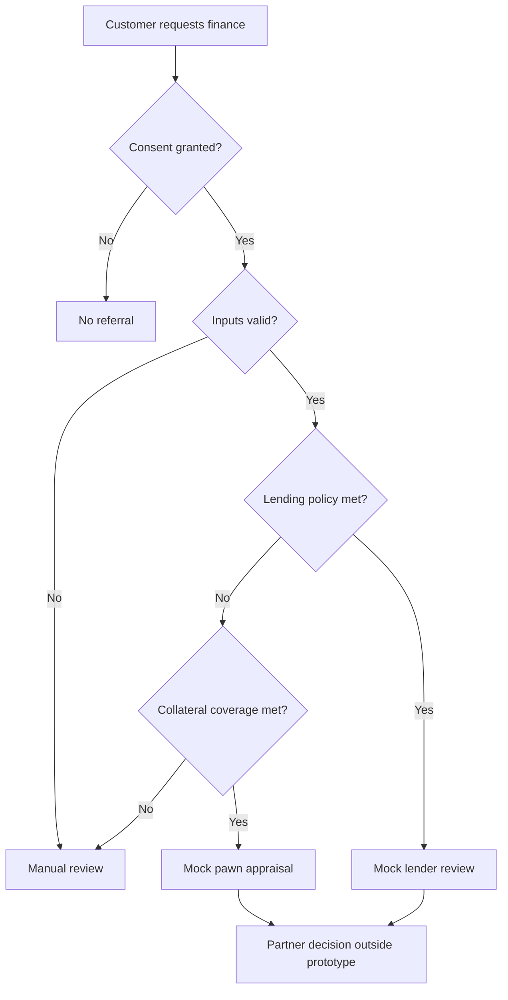

# Foundation specification

## Product and scope

**Working name:** Senang & Sulit. **Audience:** reviewers hiring data analysts or business analysts. **Primary artefact:** the orchestration logic, its data model and audit trail.

The working business hypothesis is that a shared entry point can reduce repeated data collection while routing customers toward different partner services. The prototype represents a referral platform, not a financial holding company reallocating its own loan book. Existing loan principal cannot be treated as immediately movable cash.

Actors are an applicant, the platform analyst, a pawn appraiser and a lender reviewer. Only the platform workflow is executable in this repository. All partner actors are mock destinations.

## Requirements and acceptance criteria

| ID | Requirement | Evidence |
| --- | --- | --- |
| FR-01 | Accept demo or local external credit data | Run script with and without CSV argument |
| FR-02 | Preserve one feature row per application | SQL grain test |
| FR-03 | Use historical information available before application | Future-history exclusion test |
| FR-04 | Record an understandable decision reason | Routing audit CSV and dashboard |
| FR-05 | Prevent referrals without consent | Consent routing and payload tests |
| FR-06 | Avoid real outbound partner requests | Local JSON only, `NOT_SENT` status |
| FR-07 | Keep labels separate from routing inputs | SQL feature and augmentation leakage tests |
| FR-08 | Reproduce a scenario | Fixed seed, snapshot, policy and input checksum |

## Customer journey

A repeat customer could later reapply for another service; this is a hypothesised journey, not an observed transition. The initial dataset has one application per generated customer, so no longitudinal graduation rate is reported.

## Data dictionary

| Entity / field | Meaning and provenance |
| --- | --- |
| customers.customer_id | Run-local surrogate ID; not a bank account or persistent identity |
| annual_income | `person_income` from input, or demo generator; source monetary units |
| employment_years | `person_emp_length`; missing is not zero |
| prior_default | `cb_person_default_on_file`, Y/N; not a SLIK score |
| source | `synthetic_demo` or `external_credit_csv` |
| applications.application_id | Run-local application key |
| application_date | Fixed synthetic snapshot, not an actual origination date |
| requested_amount | `loan_amnt`; not an approved or disbursed balance |
| collateral_value | Invented scenario value in the same numerical units |
| consent | Simulated permission for workflow testing, not collected consent |
| pawn_history | Invented closed events within 730 days before snapshot |
| redeemed | Synthetic 0/1 outcome of a pawn event, not a credit default label |
| pawn_trans_count_2yr | SQL count before application, including lower 730-day boundary |
| pawn_repayment_rate | Redeemed / closed events; NULL when there is no history |
| outcomes.default_label | Input `loan_status`; 1=default, 0=non-default, window unverified |
| decisions | Application route, reason, policy version and amount/income ratio |

Annual income and employment are assumed to be application-time fields for the prototype. A real dataset requires verification of feature availability. Synthetic pawn counts use an income-conditioned Poisson distribution; redemption uses Bernoulli(0.8). These are test assumptions, not statements about Indonesian households. The label is never used in augmentation.

The operational schema is normalised with foreign keys. Outcome data is stored separately, and the analytical view joins pre-aggregated history to prevent duplicate application rows. Savings, macro indicators, actual repayments and disbursements are not fabricated as observed data.

## Metric definitions

- **Application count:** number of rows in the selected route.
- **Requested volume:** sum of finite, positive application amounts. Invalid values are omitted from volume but still counted as applications.
- **Lending referral volume:** requested volume routed to the mock lender.
- **Hypothetical fee:** referred volume × assumed funded share × assumed fee rate. The CSV uses 100% funded share as a scenario ceiling; the dashboard lets the analyst vary it.
- **Monthly pawn activity:** count of synthetic closed events. `LAG` compares the previous populated month; it does not fill missing months with zero.

NPL, CLV, realised revenue and CAC improvement are intentionally not reported: they need observations this foundation does not have.

## Design decisions and limits

- Base R handles generation and decisions; DBI/RSQLite handle SQL; jsonlite handles payloads; Shiny and DT provide an R-native analyst workspace with searchable decisions and case inspection. Power BI/Tableau can consume the CSV exports later.
- Policy rules are preferred for the first foundation so every result is inspectable. They do not masquerade as ML or a probability of default.
- Missing financial inputs are preserved for review; labels are nullable. Structural CSV errors stop ingestion.
- Destination names are generic. The mock request format is versioned but is not a bank specification.
- Data is local. There is no authentication, encryption implementation, live identity verification, consent service or deployment. Keep the app local and use public/de-identified or demo data only.
- Package versions are recorded in each run, not yet locked with renv. R and package versions may affect reproducibility across environments.

## First validation run

With 10,000 demo customers, seed 42 and policy demo-0.1.0, the initial local run produced 3,662 lending referrals, 1,412 pawn appraisals, 4,421 manual reviews and 505 no-referral decisions. These counts demonstrate the pipeline and policy only; they are not business findings.
