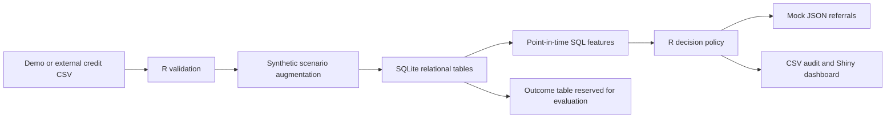

# Senang & Sulit — Financial Orchestration Lab

An R + SQL portfolio project for data analyst and business analyst roles, exploring one financial entry point for **gadai (pawn)** and **lending referrals** across changing customer needs.

The deliverable is a reproducible data pipeline and explainable decision engine. This first foundation implements an asset-light referral simulation: it does not lend, move money, contact banks, or imply a partnership with SeaBank, Allo Bank, or any other institution.

## Run it

Requires R (tested with 4.5.1). Open `Fintech.Rproj`, or run these commands from the repository root:

```sh
Rscript scripts/setup.R
Rscript scripts/run_pipeline.R
Rscript tests/run_tests.R
Rscript tests/smoke_pipeline.R
Rscript tests/dashboard.R
Rscript -e "shiny::runApp('.', launch.browser = TRUE)"
```

The default run creates 10,000 deterministic demo customers. To use the dataset suggested in the discussion, download [Kaggle Credit Risk Dataset by laotse](https://www.kaggle.com/datasets/laotse/credit-risk-dataset), review its terms, and place the CSV in `data/raw/`:

```sh
Rscript scripts/run_pipeline.R data/raw/credit_risk_dataset.csv
```

External data stays local and is excluded from Git. Import errors stop the pipeline. Currency and population provenance are not assumed: amounts remain **source units**, not rupiah. See [data instructions](data/raw/README.md).

The dashboard has three views: **Portfolio overview** for route mix and review workload, **Application review** for searching, inspecting and exporting decisions, and **Fee scenarios** for funding-conversion and fee-rate sensitivity. Select a table row to see its inputs and policy reference. The fee scenario always uses the full lending-referral portfolio; application-table filters do not change its scope. Restart the app after changing its source files or regenerating the data.

## What works now

- Seeded credit demo and external CSV ingestion, with schema validation.
- Synthetic two-year pawn history, collateral and consent scenarios, independent of outcome labels.
- SQLite tables with keys and constraints; point-in-time SQL joins and monthly `LAG` analysis.
- Versioned routing policy with decision reasons and a manual-review path.
- Local JSON mock referral requests with minimal fields, marked `NOT_SENT`.
- Shiny analyst workspace with portfolio metrics, routing mix, a searchable application queue, individual decision explanations, CSV export and interactive fee scenarios.
- Automated checks for routing, consent, referential integrity, reproducibility and leakage.



## Decision logic

Rules are illustrative assumptions in [config/policy.R](config/policy.R), not validated underwriting criteria.

| Priority | Condition | Result |
| --- | --- | --- |
| 1 | Consent absent | No referral |
| 2 | Missing or invalid financial input | Manual review |
| 3 | No prior default, requested amount / annual income ≤ 0.30, employment ≥ 1 year | Lending referral |
| 4 | Requested amount ≤ 65% of simulated collateral value | Pawn appraisal |
| 5 | Otherwise | Manual review |

The amount/income ratio is not a debt-service ratio. Current liabilities, instalments, affordability, appraisal and partner checks are not available. High risk alone never automatically qualifies someone for pawn finance. Historical redemption features are computed for analysis but do not establish repayment capacity or drive this policy.

## Inspect the outputs

| File in `outputs/` | Purpose |
| --- | --- |
| `orchestration.sqlite` | Customers, applications, pawn history, outcomes, decisions |
| `customer_features.csv` | One row per application; outcomes excluded |
| `routing_decisions.csv` | Route, reason and policy version |
| `mock_requests.json` | Local, project-specific request format |
| `route_summary.csv` | Requested volumes and hypothetical fee ceiling |
| `monthly_pawn.csv` | Synthetic transaction counts and month-to-month change |
| `manifest.json` | Source, input hash (external CSV), seed and policy |
| `session-info.txt` | R and package versions for the run |

Reruns replace generated outputs; archive the output directory before running another scenario if you want to compare them. The dashboard reads the most recent run on startup. Do not run multiple pipelines into the same output directory concurrently.

## Business question and evidence

Can a common data layer produce traceable referrals across lending and pawn services? This foundation demonstrates that workflow. It does **not** establish demand, profitability, reduced CAC, improved default prediction or cross-cycle resilience. Fee figures are sensitivity calculations, not revenue: referral amount × assumed funding conversion × fee rate, before costs.

The default synthetic credit label has a deliberately constructed relationship with income, requested amount and prior default. Training on it would test recovery of that generator, not real-world underwriting. Imported default labels also lack a verified performance window, so they must not be presented as an observed NPL rate.

The notes' proposed SNAP integration is narrowed here: [Bank Indonesia defines SNAP as an open API **payment** standard](https://www.bi.go.id/id/layanan/Standar/SNAP/default.aspx). This mock lending schema makes no SNAP compliance claim. Pseudonymous IDs are not encryption or proof of anonymisation; no production security or regulatory compliance is claimed.

## Next bricks

1. Audit the external dataset's provenance, missingness, duplicates, target definition and licence.
2. Build a logistic regression baseline in R with a frozen holdout, train-only preprocessing, ROC-AUC, PR-AUC, Brier score and calibration. Compare with a majority baseline before adding XGBoost.
3. Evaluate synthetic pawn features through explicit ablation; never infer genuine predictive uplift from invented histories. Obtain legitimate linked longitudinal data to test the business hypothesis.
4. Add savings history when an appropriate source exists; add a warehouse star schema and PostgreSQL/dbt only when reporting warrants them.
5. Define partner-specific contracts and a local R API adapter once the decision schema is stable. Keep actual integration as a separate, authorised project.

See [business requirements and data dictionary](docs/foundation.md). No Python is used.
